# 缘起

最近项目需要写一个简单的网页版聊天室，没什么好考虑的，因为项目使用的是`Java` 技术栈，所以直接选用 `netty + websocket` 实现。并做个简单记录，方便最小模块复用～


本系统主要采用短连接 + 长连接。

> 用户的注册登录、账户管理、好友关系链等功能使用http协议，因此将这个模块做成一个restful服务，对外暴露http接口供客户端调用。
>
> 实时消息使用 `websocket` 


---


[TOC]


## 基础架构

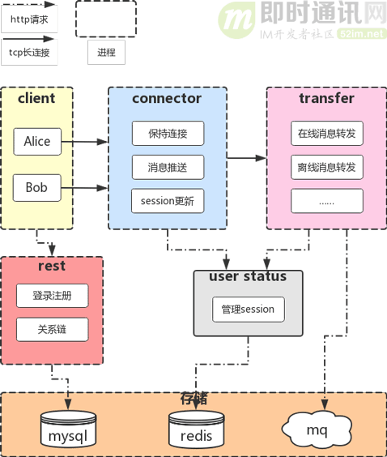

# 🎯目标

主要小目标以及实现。

- [x] 用户会话管理

- [ ] 消息的可靠性

  - [ ] 不丢失
  - [ ] 不重复
  - [ ] 不乱序

  

## 用户会话管理

```uml
@startuml
participant frontend as f#lightblue
participant WebSocketServerProtocolHandler as w #lightyellow
participant authHandler as a #lightgreen
participant websocketHandler as o #409EFF
participant SessionManager as s #67C23A
autonumber

f -> w : 握手升级websocket
a -> a: 启动连接关闭定时器
a -> a : 启动认证催促定时器
a -> f: 催促发送身份认证包，超时自动关闭连接
f -> a: 身份认证
a -> a: 身份认证完毕，清除channel的认证处理器，清除定时器
a -> s : 会话 channel 存储
f -> o : 消息
o -> f : 消息
f -> s : 前端离线，会话清除

@enduml
```

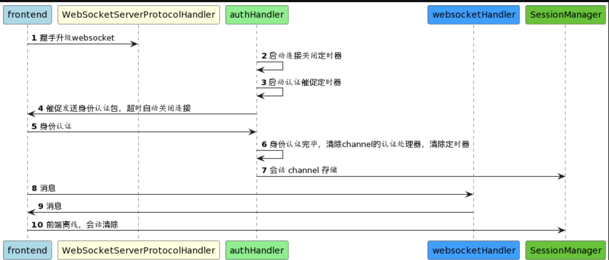


## 离线消息

如果用户当前不在线，就必须把消息持久化下来，等待用户下次上线再推送，这里使用数据库存储离线消息。

**为了方便地水平扩展，我们后续可以使用消息队列进行解耦：**

- 1）transfer接收到消息后如果发现用户不在线，就发送给消息队列入库；
- 2）用户登录时，服务器从库里拉取离线消息进行推送。


## 消息可靠性

> 网上有大神整理好了，作为一名合格的🧑‍💻咱就直接`cv`了～

### 不丢失

我们先从不丢消息开始讲起。

**首先复习一下上面章节中设计的服务端架构：**


**我们先从一个简单例子开始思考：**当Alice给Bob发送一条消息时，可能要经过这样一条链路：

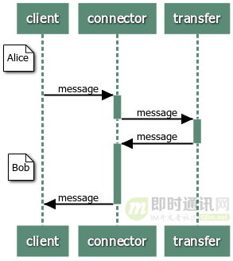

```shel
1）client-->connecter
2）connector-->transfer
3）transfer-->connector
4）connector-->client
```

在这整个链路中的每个环节都有可能出问题，虽然tcp协议是可靠的，但是它只能保证链路层的可靠，无法保证应用层的可靠。

例如在第一步中，connector收到了从client发出的消息，但是转发给transfer失败，那么这条消息Bob就无法收到，而Alice也不会意识到消息发送失败了。

**如果Bob状态是离线，那么消息链路就是：**

```shell
1）client-->connector
2）connector-->transfer
3）transfer-->mq
```


如果在第三步中，transfer收到了来自connector的消息，但是离线消息入库失败，那么这个消息也是传递失败了。

为了保证应用层的可靠，我们必须要有一个ack机制，使发送方能够确认对方收到了这条消息。

具体的实现，我们模仿tcp协议做一个应用层的ack机制。

tcp的报文是以字节（byte）为单位的，而我们以message单位。


发送方每次发送一个消息，就要等待对方的ack回应，在ack确认消息中应该带有收到的id以便发送方识别。

其次，发送方需要维护一个等待ack的队列。 每次发送一个消息之后，就将消息和一个计时器入队。

另外存在一个线程一直轮询队列，如果有超时未收到ack的，就取出消息重发。

**超时未收到ack的消息有两种处理方式：**

- 1）和tcp一样不断发送直到收到ack为止。
- 2）设定一个最大重试次数，超过这个次数还没收到ack，就使用失败机制处理，节约资源。例如如果是connector长时间未收到client的ack，那么可以主动断开和客户端的连接，剩下未发送的消息就作为离线消息入库，客户端断连后尝试重连服务器即可。

### 不重复、不乱序

有的时候因为网络原因可能导致ack收到较慢，发送方就会重复发送，那么接收方必须有一个去重机制。

去重的方式是给每个消息增加一个唯一id。这个唯一id并不一定是全局的，只需要在一个会话中唯一即可。

例如某两个人的会话，或者某一个群。如果网络断连了，重新连接后，就是新的会话了，id会重新从0开始。

接收方需要在当前会话中维护收到的最后一个消息的id，叫做lastId。

每次收到一个新消息， 就将id与lastId作比较看是否连续，如果不连续，就放入一个暂存队列 queue中稍后处理。

**例如：**

- 1）当前会话的lastId=1，接着服务器收到了消息msg(id=2)，可以判断收到的消息是连续的，就处理消息，将lastId修改为2；
- 2）但是如果服务器收到消息msg(id=3)，就说明消息乱序到达了，那么就将这个消息入队，等待lastId变为2后，（即服务器收到消息msg(id=2)并处理完了），再取出这个消息处理。

因此，判断消息是否重复只需要判断msgId>lastId && !queue.contains(msgId)即可。如果收到重复的消息，可以判断是ack未送达，就再发送一次ack。

**接收方收到消息后完整的处理流程如下：**

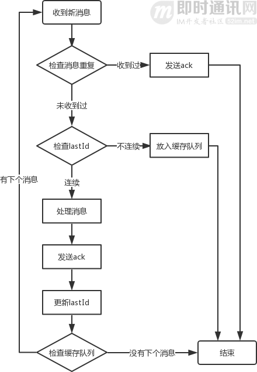

## 存储设计

* 消息协议

```java
@AllArgsConstructor
@NoArgsConstructor
@Data
@Builder
public class ChatMsg<T> implements Serializable {

    // 消息类型
    private CommandTypeEnum type;

    // 目标接受对象
    private Integer target;

    private T content;
}

```


* 消息类型

```java
public enum CommandTypeEnum {
    /**
     * 系统信息
     */
    @SerializedName("10000")
    SYSTEM(10000),


    /**
     * 建立连接
     */
    @SerializedName("10001")
    CONNECTION(10001),

    /**
     * 认证
     */
    @SerializedName("10002")
    AUTH(10002),


    /**
     * 聊天
     */
    @SerializedName("10003")
    PRIVATE_CHAT(10003),

    @SerializedName("-1")
    ERROR(-1)

    ;


    private final Integer code;

}
```


# 巨人的肩膀

1. [**跟着源码学IM(三)：基于Netty，从零开发一个IM服务端**](http://www.52im.net/thread-2768-1-1.html)
2. 


# 小问题

## 1. `SimpleChannelInboundHandler`中`channelread`和`channelread0`的区别

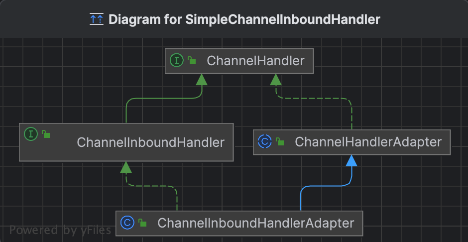


```java
package io.netty.channel;

public abstract class SimpleChannelInboundHandler<I> extends ChannelInboundHandlerAdapter {
...
    public void channelRead(ChannelHandlerContext ctx, Object msg) throws Exception {
        boolean release = true;
        try {
            if (this.acceptInboundMessage(msg)) {
                this.channelRead0(ctx, msg);
            } else {
                release = false;
                ctx.fireChannelRead(msg);
            }
        } finally {
            if (this.autoRelease && release) {
                ReferenceCountUtil.release(msg);
            }
        }

    }
    protected abstract void channelRead0(ChannelHandlerContext var1, I var2) throws Exception;
}

```

> 可以看到，`channelRead` 是`public `类型，可以被外部访问；
>
> 而`channelRead0`是`protected`类型，只能被当前类及其子类访问。
>
> `channelRead`中调用了`channelRead0`，那么`channelRead`又额外多做了什么呢？
>
> 很明显做了一个消息类型检查，判断是否会传递到下一个handler


---


## 2. 为什么选择在`http`请求成功升级`websocket`之后再做权限认证

因为在认证过程中需要给前端推送相关消息，而在`http` 未升级到 `webscket`之前，服务端无法主动推送消息。


## 3. 怎么确保认证只进行一次

在 `netty` 的`pipeline` 支持热拔插，可以在运行时删除某个`handler`, 注意细节，不要使用 `bean` 注入。

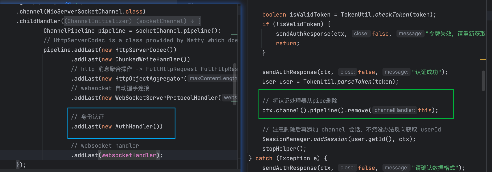


# 项目结果

## 连接后催促认证

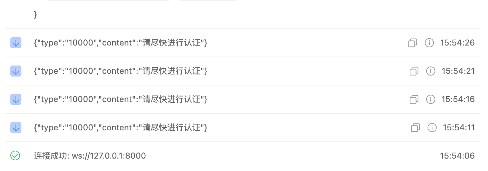

## 超时未认证连接自动关闭

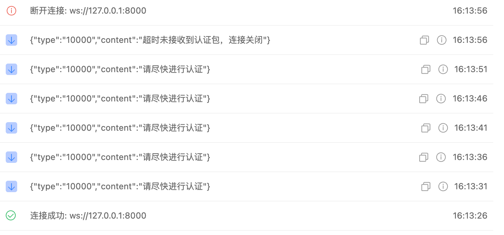

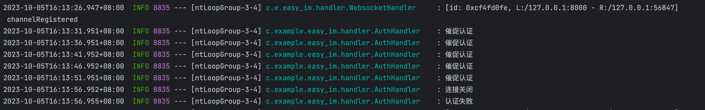

## 认证成功

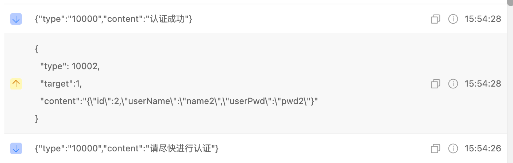

## 会话添加

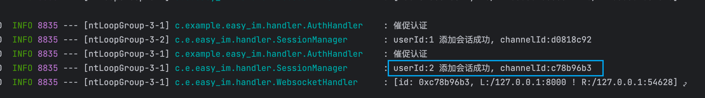

## 私聊

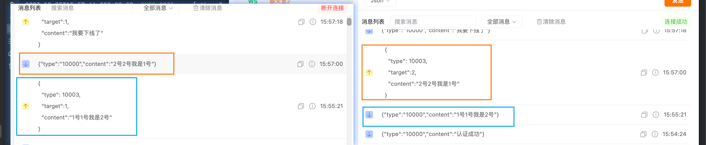

## 离线消息

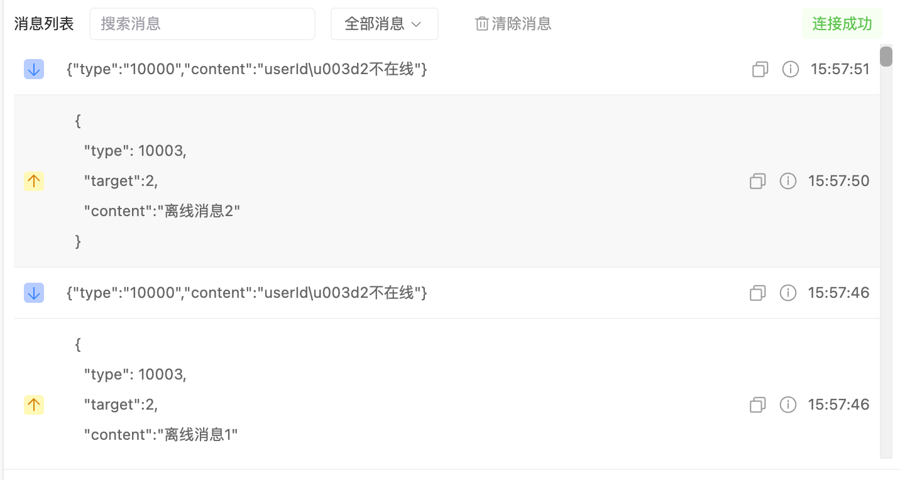

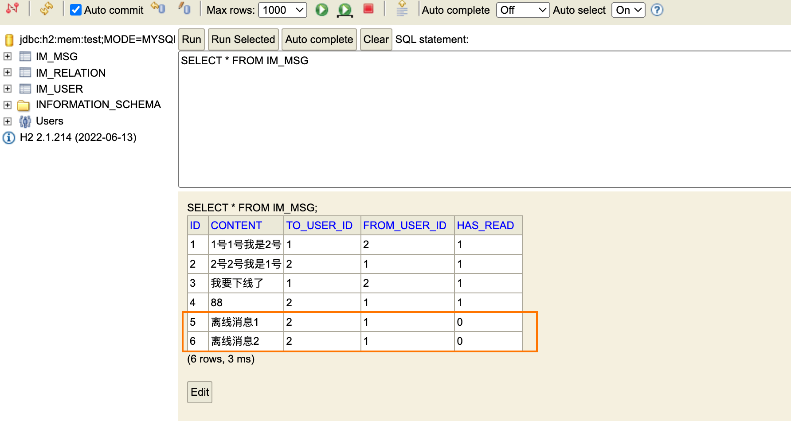
